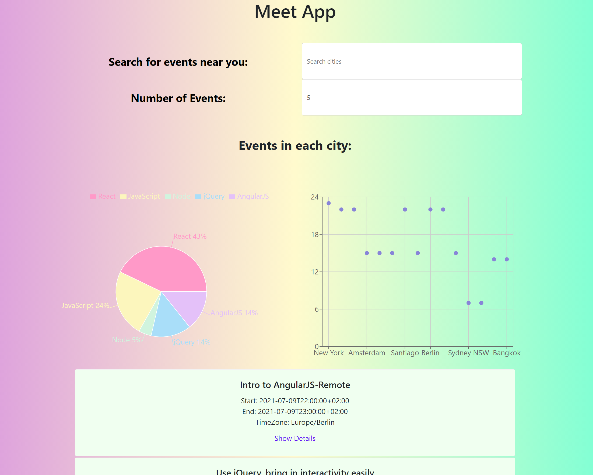

# Meet App
[Serverless](#serverless-and-api), progressive web application [(PWA)](#progressive-web-application) built with React using a test-driven development [(TDD)](#testing) technique. This application uses the Google Calendar API to fetch upcoming events. 

Live at: https://jenpyle.github.io/meet/

**See the [Detailed Project Description](#detailed-project-description) below for more information**



### Install Dependencies

```
npm install
```

### Run

```
npm run start
```

### Deploy

```
npm run deploy
```
### Run Tests

```
npm run test
```

### Check Test Coverage

```
npm test -- --coverage
```
## Key Features

- Filter events by city.
- Show/hide event details.
- Specify number of events.
- Use the app when offline.
- Add an app shortcut to the home screen.
- View a chart showing the number of upcoming events by city.

## Detailed Project Description
This single-page React application was built using [Create-React-App](https://reactjs.org/docs/create-a-new-react-app.html), which streamlined the setup process, as it included all build tools and files needed for deploying the app. This also allowed for easy conversion to PWA.

#### Testing
One main focus of this project was writing automated tests with Test Driven Development(TDD) and Behavior Driven Development(BDD), using various test automation frameworks. Setting up for these tests involved converting the project feature requirements into [User Stories](#features-user-stories-and-scenarios), which were further broken down into test scenarios using BDD’s Gherkin syntax. These test scenarios were used to base various types of testing off of. The types of tests include: Unit, Integration, Acceptance, and End-to-End testing.

Unit and Integration tests were written using [Jest](https://jestjs.io/) and [Enzyme](https://enzymejs.github.io/enzyme/docs/api/). Both following the TDD approach:
1. (Re-)Write a test
2. Test fails
3. Implement a fix
4. Test passes
5. Clean up code
6. Repeat

Unit testing verified that each component worked on its own, while Integration testing checked that all of the components continued to behave correctly when interacting in tandem with each of the other components. Through using the TDD approach, these tests informed the way in which code for each feature was developed, allowing for an optimal architecture for this app.

Additionally, Acceptance tests were written with the BDD approach, informing the documentation of the app. This ensures that every stakeholder(including non-developers) can understand the role of each of the app’s features. These tests used the Cucumber.js testing framework and jest-cucumber library.  They can be easily found in their own “feature” folder [here](https://github.com/jenpyle/meet/tree/main/src/features).

Finally, Puppeteer was used for End-to-End testing to simulate exactly what users may or may not do when interacting with the app. This test verified that the UI interactions necessary to navigate the app work properly and as designed. 

#### Serverless and API
Another important component of this project is its process of retrieving calendar event data. Meet App makes use of a "serverless" authentication service([auth-server](https://github.com/jenpyle/meet/tree/main/auth-server)) which interacts with an external Google Calendar API. This API, which provides the event data, is a protected Google Calendar API produced by CareerFoundry. As it is a protected API, obtaining a valid OAuth2 token is necessary in order to access its data. This is where the serverless functions come in, generating the OAuth2 token through a series of 3 functions. This process begins when a new user navigates to the app, automatically making a request to the API. The authentication process starts with the API confirming authorization status via checking if the user's local storage contains a valid token or authorization code, and if neither are found, the API redirects the user to a Google authorization screen. After the user signs into a Google account, the API sends an authorization code to the user's local storage and subsequently redirects the user to the main page. This authorization code is sent back to the serverless functions to first get validated and then be exchanged for an access token. After this, the user can finally gain access to the API and view the calendar event data. 

The serverless functions are hosted on AWS Lambda and were set up and deployed using the Serverless Toolkit and the “aws-nodejs” template, the functions can be [viewed here](https://github.com/jenpyle/meet/blob/main/auth-server/handler.js).  Each function is deployed individually in the AWS cloud every time a new user gets authorized. Additionally, these functions were initally tested on a static HTML site set up using a Local Node.js HTTP Server made with Node’s built-in “http-server” package. A live version of the static site can be [visited here](https://coach-courses-us.s3.amazonaws.com/exercises/1114/39917/617dc3978f89f7a2ddd024d5102b08a5/test-auth-server.html), and my individual code can be [viewed here](https://github.com/jenpyle/meet/blob/main/test/test-auth-server.html).

#### Progressive Web Application
The Lighthouse tool offered in DevTools was used to analyze the app and compare the app against PWA criteria. The app was then converted into a PWA by implementing both a web app manifest and service worker. This implementation allows the app to be installed to either the desktop or home screen and work even while offline. 

#### Data Visualization
Data visualization was incorporated into the app by adding charts that help engage users. A React-specific data visualization library called [Recharts](https://recharts.org/en-US/api) was used to add a scatter plot and a pie chart.

#### Other
Other smaller features were implimented throughout this project such as a short trial of performance monitoring with [Atatus](https://www.atatus.com/for/react), an object-oriented programming style "Alert" text, and a look into continuous delivery and continuous integration.


## Features, User stories, and Scenarios
### __FEATURE 1: FILTER EVENTS BY CITY__
*As a user, I should be able to filter events by city, so that I can see the list of events that take place in that city*

__SCENARIO 1: WHEN USER HASN’T SEARCHED FOR A CITY, SHOW UPCOMING EVENTS FROM ALL CITIES.__\
__Given__ user hasn’t searched for any city\
__When__ the user opens the app\
__Then__ the user should see a list of all upcoming events\
__SCENARIO 2: USER SHOULD SEE A LIST OF SUGGESTIONS WHEN THEY SEARCH FOR A CITY.__\
__Given__ the main page is open\
__When__ user starts typing in the city textbox\
__Then__ the user should see a list of cities (suggestions) that match what they’ve typed\
__SCENARIO 3: USER CAN SELECT A CITY FROM THE SUGGESTED LIST.__\
__Given__ the user was typing “Berlin” in the city textbox. And the list of suggested cities is showing\
__When__ the user selects a city (e.g., “Berlin, Germany”) from the list\
__Then__ their city should be changed to that city (i.e., “Berlin, Germany”). And the user should receive a list of upcoming events in that city

### __FEATURE 2: SHOW/HIDE AN EVENT’S DETAILS__
*As a user, I should be able to show or hide an event’s details, so that I can easily browse through events and choose when to view more detailed information*

__Scenario 1: An event element is collapsed by default__\
__Given__ the list of events has been loaded\
__When__ the event page is showing and the “Show details” button is not yet selected on an event\
__Then__ the event will remain collapsed \
__Scenario 2: User can expand an event to see its details__\
__Given__ the list of events has been loaded\
__When__ user clicks on “Show details” button for an event\
__Then__ the event element will be expanded to show the event details\
__Scenario 3: User can collapse an event to hide its details__\
__Given__ the detailed view of an event has been loaded\
__When__ user clicks on “Hide details” button for an event\
__Then__ the event element will be collapsed to hide the event details

### __FEATURE 3: SPECIFY NUMBER OF EVENTS__
*As a user, I should be able to specify the number of events, so that I can choose how many events I want to browse through*

__Scenario 1: When user hasn’t specified a number, 32 is the default number__\
__Given__ the main view has been loaded\
__When__ the number of events is not specified\
__Then__ a maximum of 32 events will appear \
__Scenario 2: User can change the number of events they want to see__\
__Given__ the main view has been loaded\
__When__ the number of events is set to a specific range\
__Then__ a maximum of the specified number of events will appear

### __FEATURE 4: USE THE APP WHEN OFFLINE__
*As a user, I should be able to use the app when offline, so that I can use the app even when internet is not available*

__Scenario 1: Show cached data when there’s no internet connection__\
__Given__ the main view of a city has previously been loaded\
__When__ the user is accessing a previously viewed city and does not have internet access\
__Then__ the cached data of the previously viewed city will be loaded\
__Scenario 2: Show error when user changes the settings (city, time range)__\
__Given__ the user did not have internet access\
__When__ the user attempts to change the settings\
__Then__ an error message will appear

### __FEATURE 5: DATA VISUALIZATION__
*As a user, I should be able to visualize the available event data, so that I can easily compare how eventful each city is*

__Scenario 1: Show a chart with the number of upcoming events in each city__\
__Given__ the user has opened the main view\
__When__ the user has clicked on the event chart button\
__Then__ a graphic with a chart that shows the number of upcoming events in each city will appear
